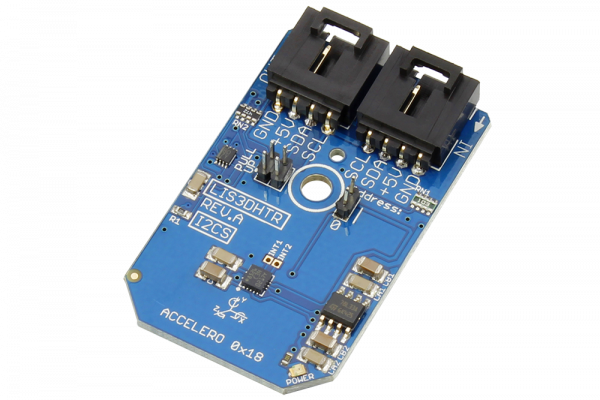

[](https://store.ncd.io/product/lis3dhtr-3-axis-accelerometer-digital-output-motion-sensor-i2c-mini-module/).

# LIS3DHTR

Manufactured by STMicroelectronics, the LIS3DHTR  has dynamically user-selectable full scales of ±2g/±4g/±8g/±16g and it is capable of measuring accelerations with output data rates from 1Hz to 5kHz.The self-test capability allows the user to check the functioning of the sensor in the final application.
This Device is available from www.ncd.io

[SKU: LIS3DHTR]

(https://store.ncd.io/product/lis3dhtr-3-axis-accelerometer-digital-output-motion-sensor-i2c-mini-module/)
This Sample code can be used with Raspberry Pi.

Hardware needed to interface LIS3DHTR 3Axis accelometer sensor With Raspberry Pi :

1. <a href="https://store.ncd.io/product/lis3dhtr-3-axis-accelerometer-digital-output-motion-sensor-i2c-mini-module/">LIS3DHTR 3Axis accelometer sensor</a>

2. <a href="https://store.ncd.io/product/i2c-shield-for-raspberry-pi-3-pi2-with-outward-facing-i2c-port-terminates-over-hdmi-port/">Raspberry Pi I2C Shield</a>

3. <a href="https://store.ncd.io/product/i%C2%B2c-cable/">I2C Cable</a>

## Python

Download and install smbus library on Raspberry pi. Steps to install smbus are provided at:

https://pypi.python.org/pypi/smbus-cffi/0.5.1

Download (or git pull) the code in pi. Run the program.

```cpp
$> python LIS3DHTR.py
```
The lib is a sample library, you will need to calibrate the sensor according to your application requirement.
